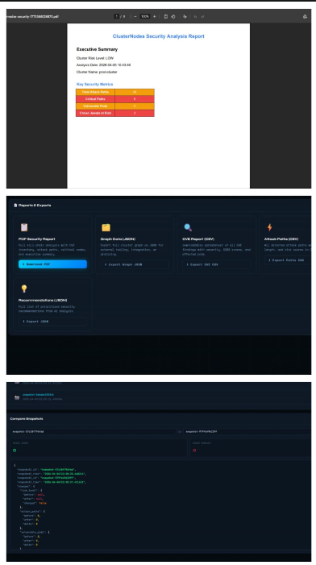

# ClusterNodes

**NOTE:** ALL THE FEATURES THAT HAS BEEN ASKED ARE ACHIEVED WITH PERFECT ACCURACY ALONG THE CHALLENGES FEATURES AS WELL USING THE PROPER MOCK DATA GIVEN BY THE ORGANISATION PANEL.

## Overview

ClusterNodes is a high-performance security analysis tool designed to visualize and neutralize multi-hop attack paths within Kubernetes clusters. By modeling cluster infrastructure as a Directed Acyclic Graph (DAG), it surfaces hidden risks that traditional static audits miss.

This platform serves as a "Security Collaborator" for DevOps teams. It transforms complex Kubernetes RBAC (Role-Based Access Control) configurations and container vulnerabilities into a navigable, interactive map. The tool identifies how an attacker can move laterally from a compromised Pod to sensitive "Crown Jewels" like production databases or secrets.

## Features

### Core Security Engine
- Queries the active state of RoleBindings, Pods, and Secrets using kubectl or the official Kubernetes Python client.
- Directed Acyclic Graph (DAG) Modeling: Represents cluster entities as Nodes and trust relationships as Directed Edges.
- CVE Vulnerability Scanning: Integrates with the NIST NVD API to assign real-time CVSS scores to Pods based on container image versions.

## The "Math Brains" (Algorithms)
- Blast Radius Detection (BFS): Uses Breadth-First Search to calculate how many resources are reachable within N hops from a compromised node.
- Shortest Path to Crown Jewels (Dijkstra's): Identifies the easiest route to sensitive data based on exploitability edge weights.
- Circular Permission Detection (DFS): Runs Depth-First Search to find mutual admin grants that create dangerous privilege escalation loops.
- Critical Node Analysis: Identifies the single node whose removal would break the highest number of attack paths through "what-if" simulations.

## X-Factor
- Advanced Remediation & AI-Powered "Security Chat": A natural language interface powered by Google Gemini that translates complex graph data into plain-English security advice.
- Auto-Fix Recommendation Engine: Automatically generates the specific Kubernetes Network Policy or RBAC YAML code needed to patch identified security gaps.
- Attack Simulator Mode: An interactive UI feature where users can "play through" an attack step-by-step to visualize the progression of a breach.

## Technology Stack

### Backend (The "Engine")
- **Language:** Python 3.10+
- **Graph Library:** NetworkX (In-memory processing)
- **API Framework:** FastAPI or Flask
- **AI Integration:** Google Gemini API (Flash 2.0)
- **K8s Client:** Official Kubernetes or the given mock data provided
- **PDF Generation:** FPDF2

## Project Structure

Based on the provided file structure:

```
ClusterNodes/
├── backend/                # Python Security Analysis Engine
│   ├── ai/                 # Gemini API integration and prompts
│   ├── analysis/           # Attack path and blast radius logic
│   ├── cli/                # Typer-based command line interface
│   ├── core/               # Kubernetes client and ingestion logic
│   ├── reports/            # PDF Kill Chain report generation
│   ├── storage/            # Local JSON/Cache storage
│   ├── server.py           # Main FastAPI/Flask application
│   └── requirements.txt    # Backend dependencies
├── frontend/               # React-Vite Dashboard
│   ├── src/
│   │   ├── components/     # UI components (GraphView, ChatBox, etc.)
│   │   ├── pages/          # Dashboard, Analytics, and Simulation pages
│   │   └── App.jsx         # Main application routing
│   ├── index.html          # Main entry point
│   └── vite.config.js      # Frontend build configuration
└── data/                   # Mock data and CVE cache
```

## API Endpoints

```
GET  /api/analyze                    - Run comprehensive analysis
GET  /api/graph                      - Get graph data
GET  /api/attack-paths               - List all attack paths
GET  /api/blast-radius/{node_id}     - Calculate blast radius
GET  /api/simulate/{node_id}         - Simulate attack
GET  /api/critical-nodes             - Get critical nodes
GET  /api/circular-permissions       - Detect cycles
GET  /api/cve-scan                   - CVE vulnerabilities
POST /api/fix                        - Generate remediation YAML
POST /api/ai-chat                    - AI security chat
GET  /api/report/pdf                 - Generate PDF report
POST /api/snapshot                   - Create snapshot
GET  /api/snapshots                  - List snapshots
POST /api/diff                       - Compare snapshots
```

## Installation & Usage

### Prerequisites
- Python 3.10+
- Node.js 18+
- Access to a Kubernetes cluster (or use mock-cluster-graph.json)

### Backend Setup
1. Navigate to the backend directory:
   ```
   cd backend
   ```
2. Install dependencies:
   ```
   pip install -r requirements.txt
   ```
3. Run the server:
   ```
   python server.py
   ```

## License

This project is developed for hackathon purposes and is currently unlicensed/open-core.

## Output & Result




**NOTE:** ALL THE FEATURES THAT HAS BEEN ASKED ARE ACHIEVED WITH PERFECT ACCURACY ALONG THE CHALLENGES FEATURES AS WELL USING THE PROPER MOCK DATA GIVEN BY THE ORGANISATION PANEL.